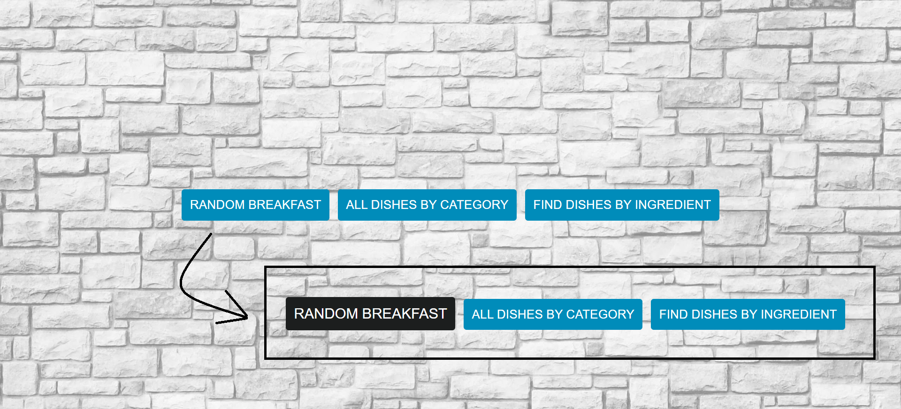
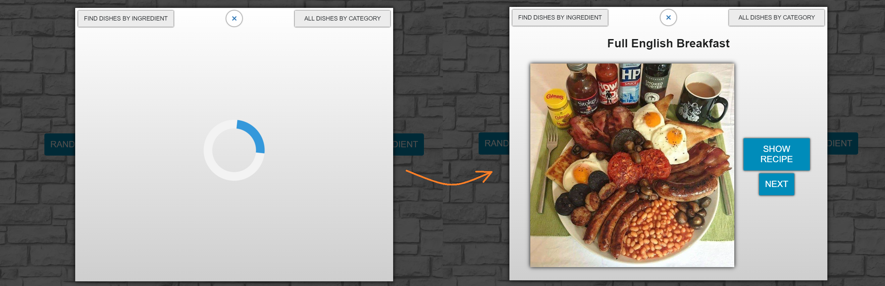
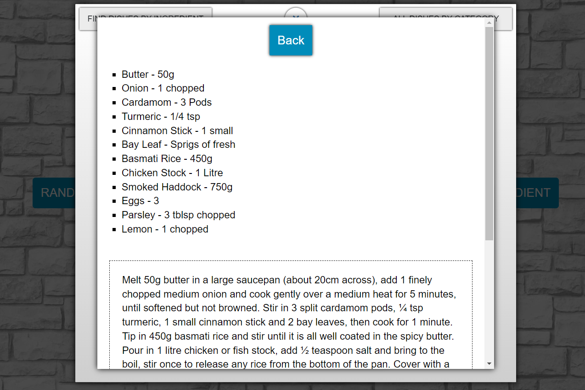
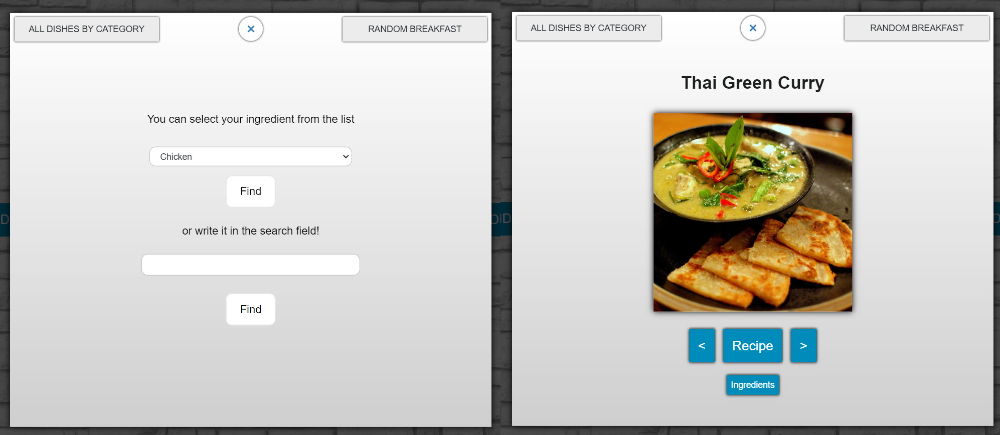
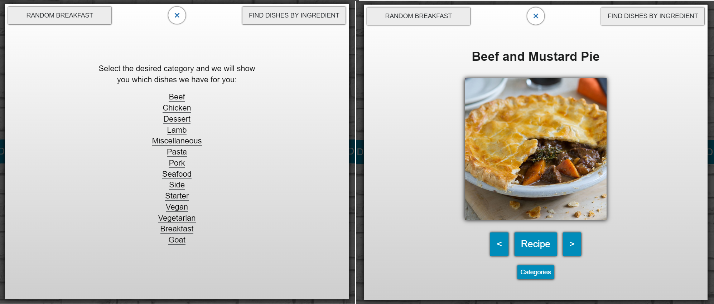

# Рецепты. Модальные окна
Native JS. Учебный проект.

### Описание

В приложении реализованы три модальных окна с рецептами блюд из внешнего API. Окна открываются при нажатии на соответствующие кнопки.  
С модального окна можно переключаться на следующее и предыдущее.  

### Технологии
JavaScript, CSS, Webpack, Fetch  

### Как запустить приложение
```
yarn build - собирает проект
Дальше смотреть в index.html
```

### Скриншоты
Модальные окна открываются при клике на соответствующие кнопки:  

  
Модалка с рандомными завтраками:  

  
Рецепт выбранного блюда:  

  
Модалка с блюдами по ингредиентам:  

  
Модалка с блюдами по категориям:  

